# Confronto di CNN e SVM per la classificazione di cani e gatti
## Elaborato per il corso di Analisi delle Immagini
### Miriam Santoro
#### aa. 2017/2018, Università di Bologna - Corso di laurea magistrale in Fisica Applicata

## Scopo del progetto
Il presente lavoro è stato realizzato in linguaggio `matlab` e si pone come obiettivo l'implementazione e la valutazione di:
1. Rete neurale convoluzionale (CNN) da zero;
2. Rete neurale convoluzionale (CNN) da zero + Augment del dataset;
3. Rete neurale convoluzionale (CNN) basata su un modello di CNN pre-allenato (`AlexNet`);
4. SVM a partire da `AlexNet`.

Queste tre casistiche sono state applicate a due dataset diversi, ovvero:
1. `CIFAR10`
2. `Kaggle`

Il progetto ha previsto anche l'implementazione di add-ons per matlab, quali:
1. `Image Processing Toolbox`
2. `Neural Network Toolbox`
3. `Parallel Computing Toolbox`
4. `Neural Network Toolbox Model for AlexNet Network`
5. `Deep Learning Network Analyzer for Neural Network Toolbox`

## Esecuzione del progetto
Le reti neurali sono state implementate in 6 script diversi, a seconda della loro tipologia e del dataset utilizzato. Nello specifico:
- `TrainingCIFAR10.m` contiene la CNN allenata da zero sul dataset CIFAR10;
- `Training.m` contiene la CNN allenata da zero sul dataset Kaggle;
- `Training_AugmentCIFAR10.m` contiene la CNN allenata da 0 sulle immagini augmented del dataset CIFAR10;
- `Training_Augment.m` contiene la CNN allenata da 0 sulle immagini augmented del dataset Kaggle;
- `TrasfLearning_CIFAR10.m` contiene la CNN AlexNet pre-allenata adattata alle immagini del dataset CIFAR10;
- `TrasfLearning.m` contiene la CNN AlexNet pre-allenata adattata alle immagini del dataset Kaggle;
- `SVM_CIFAR10.m` contiene la SVM utilizzata sul dataset CIFAR10;
- `SVM_MyNey.m` contiene la SVM utilizzata sul dataset Kaggle.

## Dataset (Note preliminari)
Di seguito si descrivono i dataset utilizzati per ogni CNN. Entrambi i dataset possiedono 5000 elementi per il training e 1000 elementi per il testing e questa divisione è stata realizzata al fine di evitare errori di overfitting.
Inoltre, le 5000 immagini di training sono  ulteriormente divise in 80% training e 20% validation per regolare l'architettura del classificatore stesso, aggiustandone i parametri.

Per adattare i dataset alle dimensioni di input delle CNN sono usati gli script:
- `readFunctionTrain` per la CNN da 0 e la CNN con l'augmentation. Questa funzione è in grado di ridimensionare ogni immagine di input in maniera da avere in output un'immagine di dimensione 32x32;
- `readFunctionTrain2` per la CNN basata su AlexNet e la SVM. Questa funzione è in grado di ridimensionare ogni immagine di input in maniera da avere in output un'immagine di dimensione 227x227.

In realtà, ogni immagine, essendo a colori, ha dimensioni [n_pixel x n_pixel x 3].
### CIFAR10
Il dataset CIFAR-10 è formato da 60000 immagini colorate 32x32 disposte in 10 classi. Quindi, ci sono 6000 immagini per classe divise, come già esplicitato, in 5000 immagini di training e 1000 immagini di testing.

In questo progetto vengono usate solo 2 delle 10 classi appartenenti a questo dataset: `Cat` e `Dog`.

Per scaricare il dataset e prepararlo in maniera da disporre le immagini in apposite cartelle è stato utilizzato lo script `DownloadCIFAR10.m`, scaricato dal sito di matlab (link: https://www.mathworks.com/matlabcentral/mlc-downloads/downloads/submissions/62990/versions/3/previews/DeepLearningDemos/DownloadCIFAR10.m/index.html).

I dati, comprendenti immagini e labels, sono importati nel progetto come mostrato nel seguente esempio di codice:
```matlab
  #da TrainingCIFAR10.m

  categories = {'Dog','Cat'};

  rootFolder = 'cifar10/cifar10Train';
  imds = imageDatastore(fullfile(rootFolder, categories), ...
      'LabelSource', 'foldernames');
  imds.ReadFcn = @readFunctionTrain;
  
  [imdsTrain,imdsValidation] = splitEachLabel(imds,0.8,'randomized');     #divide train set e validation set
```

### Kaggle
Il dataset Kaggle è formato da 25000 immagini colorate di dimensioni diverse disposte in due classi (ovvero `cats` e `dogs`). Quindi per ogni classe si hanno a disposizione 12500 immagini totali.

In questo progetto per ogni classe vengono usate solo 5000 immagini di training (da *cat.0* a *cat.4999* e da *dog.0* a *dog.4999*) e 1000 immagini di testing (da *cat.5000* a *cat.5999* e da *dog.5000* a *dog.5999*).

Il dataset è stato scaricato dal sito della Kaggle e le immagini sono state poste manualmente nelle rispettive cartelle.

I dati sono importati nel progetto come mostrato nel seguente esempio di codice:
```matlab
  #da Training.m

  categories = {'dogs','cats'};

  rootFolder = 'dataset/train_set';
  imds = imageDatastore(fullfile(rootFolder, categories), ...
      'LabelSource', 'foldernames');
  imds.ReadFcn = @readFunctionTrain;

  [imdsTrain,imdsValidation] = splitEachLabel(imds,0.8,'randomized');
```


## Analisi delle CNN
Le reti neurali convoluzionali (CNN) hanno architetture che le rendono particolarmente adatte al riconoscimento delle immagini, in maniera da poterle classificare. Nello specifico:
-  diversi layers della rete neurale imparano a rilevare e identificare le diverse features delle immagini;
-  il penultimo layer genera un vettore delle stesse dimensioni del numero di classi che la rete deve essere in grado di prevedere 
- l'ultimo layer che fornisce l'output di classificazione.

Siccome le CNN sono addestrate su molte immagini e lavorano con una grande quantità di dati e con diverse architetture, si ritiene opportuno utilizzare la GPU per velocizzare significativamente il tempo necessario per allenare un modello.

Esempio di struttura di una CNN.


Di seguito sono riportate e spiegate le varie tipologie di layers utilizzate nelle diverse CNN all'interno di questo progetto:
- **Livello di Input** dell'immagine: immette le immagini nella rete e applica la normalizzazone dei dati.

- **Livello di Convoluzione 2-dim**: applica filtri convoluzionali all'input. In questo livello viene eseguita la convoluzione che è un'operazione che consiste nel muovere filtri di specifiche dimensioni verticalmente e orizzontalmente sull'immagine di input, calcolare il prodotto scalare dei pesi e aggiungere, eventualmente, un termine di bias.
I parametri del livello consistono, quindi, in un set di filtri apprendibili (o kernel), che hanno un piccolo campo recettivo, ma si estendono lungo tutta la pronfondità del volume di input, compiono convoluzione durante il passaggio all'indietro (forward) e producono una mappa di attivazione 2-dim. L'operazione di convoluzione riduce il numero di parametri liberi, permettendo al network di essere più profondo con meno parametri. Ad esempio, usare regioni di dimensione 5x5, ognuna con gli stessi pesi condivisi, richiede solo 25 parametri apprendibili. In questo modo, risolve il problema dei gradienti che svaniscono o esplodono nell'allenamento tradizionale di network neurali multi-strato. 

    - La dimensione di step con cui il filtro si muove è chiamata `'Stride'` ed è regolabile. 

    - Si può anche applicare uno zero padding all'immagine di input, consistente nell'agginuta di righe e colonne ai limiti dell'immagine stessa. Questo viene fatto regolando il termine `'Padding'` e si usa per controllare la dimensione di output dello strato.

- **Livello di Max Pooling 2-dim**: divide l'immagine di input in un set di rettangoli che non si sovrappongono e, per ogni sotto-regione, fornisce in output il massimo. 
Quindi si passa da cluster di neuroni nello strato di partenza a singoli neuroni in quello di output (processato).

- **Livello di passaggio per la funzione ReLU**: scarta i valori negativi ottenuti finora, applicando una funzione di threshold del tipo: 

    <a href="https://www.codecogs.com/eqnedit.php?latex=f(x)&space;=&space;\begin{cases}&space;x,&space;&&space;x&space;\geq&space;0&space;\\&space;0,&space;&&space;x<0&space;\end{cases}" target="_blank"></a>

- **Livello di Cross Channel Normalization**: normalizza il canale sfruttando tramite la risposta locale del canale. Nello specifico rimpiazza ogni elemento con un valore normalizzato, ottenuto usando gli elementi provenienti da un certo numero di canali vicini (elementi nella finestra di normalizzazione).

- **Livello di Avg Pooling**: divide l'immagine di input in un set di rettangoli che non si sovrappongono e, per ogni sotto-regione, fornisce in output il valore medio.

- **Livello di Dropout**: setta in modo random gli elementi di input uguali a 0 con una data probabilità.

- **Livello Fully Connected**: collega i neuroni a tutte le attivazioni nel livello precedente. L'attivazione è calcolata moltiplicando gli input per una matrice di pesi e aggiungendo un vettore di bias.

- **Livello per la funzione di attivazione 'softmax'**: specifica come l'allenamento penalizzi la deviazione tra labels predette e vere. Questo strato definisce la funzione di attivazione di output, ovvero:

   <a href="https://www.codecogs.com/eqnedit.php?latex=y_r(x)&space;=\frac{exp(a_r(x)}{\sum^k_{j=1}exp(a_j(x))}" target="_blank"></a>

    dove <a href="https://www.codecogs.com/eqnedit.php?latex=\inline&space;0&space;\leq&space;y_r(x)&space;\leq&space;1" target="_blank"></a> e <a href="https://www.codecogs.com/eqnedit.php?latex=\inline&space;\sum^k_{j=1}y_j=1" target="_blank"></a>.

- **Livello finale di classificazione**: calcola la cross entropy loss in quanto il progetto ha come scopo la classificazione tra classi che si escludono a vicenda. In definitiva, la funzione di perdita è:
    <a href="https://www.codecogs.com/eqnedit.php?latex=\text{loss}=&space;\sum^N_{i=1}\sum^k_{j=1}&space;t_{ij}&space;\text{ln}&space;y_{ij}" target="_blank"></a>.

### 1. CNN from scratch
La CNN creata da 0 è formata da 15 strati con la seguente architettura:
1. Livello di Input che ha le stesse dimensioni delle immagini in input (in questo caso, [32x32x3]);
2. Livello di Convoluzione 2-dim con 32 filtri (kernels) di dimensioni 5x5x3, passo di dimensione [1 1] e zero-padding di dimensione [2 2 2 2];
3. Livello di Max Pooling 2-dim con dimensione di pool 3x3 e passo di dimensione [2 2];
4. Livello di passaggio per la funzione ReLU;
5. Livello di Convoluzione 2-dim con 32 filtri (kernels) di dimensioni 5x5x32, passo di dimensione [1 1], zero-padding di dimensione [2 2 2 2];
6. Livello di passaggio per la funzione ReLU;
7. Livello di Avg Pooling 2-dim con dimensione di pool 3x3 e passo di dimensione [2 2];
8. Livello di Convoluzione 2-dim con 64 kernels di dimensioni 5x5x32, passo di dimensione [1 1], zero-padding di dimensione [2 2 2 2];
9. Livello di passaggio per la funzione ReLU;
10. Livello di Avg Pooling con dimensione di pool 3x3 e passo di dimensione [2 2];
11. Livello Fully Connected con 64 outputs;
12. Livello di passaggio per la funzione ReLU;
13. Livello Fully Connected con 2 outputs;
14. Livello per la funzione di perdita 'softmax';
15. Livello finale di classificazione.

Per l'addestramento della CNN si sottopone alla rete neurale l'intero dataset mescolato più volte, dove il numero di "mescolamenti" è chiamato `'MaxEpochs'`.
Inoltre per ogni iterazione di allenamento il dataset è processato in maniera che un sottoinsieme del set di training, definito dalla variabile `'MiniBatchSize'` venga usato per valutare il gradiente della funzione di perdita e aggiornare i pesi. In questo caso si è specificato il rimescolamento ad ogni epoch tramite la variabile `'Shuffle'`. 

Come funzione di errore viene utilizzata `'sgdm'`, ovvero *Stochastic Gradient Descent with Momentum optimizer*, una funzione che esegue la discesa gradiente stocastica con un'ottimizzazione del momento che, in questo caso è lasciato di default.
L'algoritmo di discesa gradiente aggiorna i parametri del network (pesi e bias, definiti nell'architettura) per minimizzare la funzione di perdita prendendo piccoli steps nella direzione del gradiente negativo della perdita. A questo viene aggiunto un termine di momento per ridurre l'oscillazione lungo il cammino. Di conseguenza,  l'equazione che governa questo processo è: 

<a href="https://www.codecogs.com/eqnedit.php?latex=\theta_{l&plus;1}&space;=&space;\theta_l-\alpha&space;\Delta&space;E(\theta_l)&space;&plus;\gamma(\theta_l-\theta_{l-1})" target="_blank"></a>

dove: 
- *l* è il numero di iterazioni, 
- <a href="https://www.codecogs.com/eqnedit.php?latex=\inline&space;\alpha&space;>0" target="_blank">0" title="\alpha >0" /></a> è la frequenza di apprendimento, 
- <a href="https://www.codecogs.com/eqnedit.php?latex=\inline&space;\theta" target="_blank"></a> è il vettore parametro 
- <a href="https://www.codecogs.com/eqnedit.php?latex=\inline&space;E(\theta)" target="_blank"></a> è la funzione di perdita
- <a href="https://www.codecogs.com/eqnedit.php?latex=\inline&space;\gamma" target="_blank"></a> determina il contributo del precedente step di gradiente all'iterazione corrente.

Inoltre, per quanto riguarda la `'sgdm'` si è specificata anche la frequenza di apprendimento iniziale, tramite il parametro `'InitialLearningRate'`.

#### 1a. CIFAR10
Di seguito è riportato lo script relativo al training:
```matlab
%da TrainingCIFAR10.m

varSize = 32;
conv1 = convolution2dLayer(5,varSize,'Padding',2,'BiasLearnRateFactor',2);
conv1.Weights = gpuArray(single(randn([5 5 3 varSize])*0.0001));
fc1 = fullyConnectedLayer(64,'BiasLearnRateFactor',2);
fc1.Weights = gpuArray(single(randn([64 576])*0.1));
fc2 = fullyConnectedLayer(2,'BiasLearnRateFactor',2);
fc2.Weights = gpuArray(single(randn([2 64])*0.1));

layers = [
    imageInputLayer([varSize varSize 3], 'Name', 'input');
    conv1;
    maxPooling2dLayer(3,'Stride',2, 'Name', 'max_pool');
    reluLayer('Name', 'relu_1');
    convolution2dLayer(5,48,'Padding',2,'BiasLearnRateFactor',2, 'Name', 'conv_2');
    reluLayer('Name', 'relu_2');
    averagePooling2dLayer(3,'Stride',2, 'Name', 'avg_pool_1');
    convolution2dLayer(5,64,'Padding',2,'BiasLearnRateFactor',2, 'Name', 'conv_3');
    reluLayer('Name', 'relu_3');
    averagePooling2dLayer(3,'Stride',2, 'Name','avg_pool_2');
    fc1;
    reluLayer('Name', 'relu_4');
    fc2;
    softmaxLayer('Name', 'softmax');
    classificationLayer('Name', 'classification')];

opts = trainingOptions('sgdm', ...
    'InitialLearnRate', 0.0001, ...
    'MaxEpochs', 5, ...
    'Shuffle','every-epoch', ...
    'MiniBatchSize', 10, ...
    'ValidationData',imdsValidation, ...
    'ValidationFrequency',400, ...
    'Verbose', true, ...
    'VerboseFrequency', 400, ...
    'Plots','training-progress', ...
    'ExecutionEnvironment', 'auto');

[net, info] = trainNetwork(imdsTrain, layers, opts);

cifar10_net= net;
save cifar10_net
```

I risultati sono visualizzati in tempo reale in Training Progress e sono mostrati nella seguente figura:

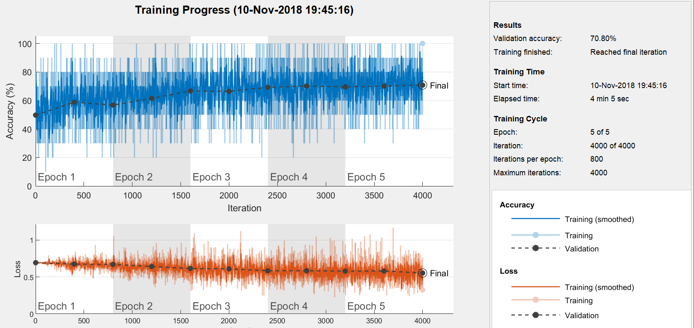 


Per quanto riguarda il testing si è verificato che il valore dell'accuratezza fosse compatibile con quello della validazione ottenuta durante il processo di training. 
L'accuratezza di testing è fornita dalla media delle labels predette correttamente uguali a quelle di input. In altre parole, l'accuratezza è fornita dalla media tra i termini della diagonale della matrice di confusione ciascuno normalizzato per il numero totale di esempi di training.

Di seguito è riportato lo script relativo al testing:
```matlab
%da TrainingCIFAR10.m

load cifar10_net;
    rootFolder2 = 'cifar10/cifar10Test';
imdsTest = imageDatastore(fullfile(rootFolder2, categories), ...
    'LabelSource', 'foldernames');
imdsTest.ReadFcn = @readFunctionTrain;

labels = classify(cifar10_net, imdsTest);
accuracy = mean(labels == imdsTest.Labels)

figure
plotconfusion(imdsTest.Labels, labels)
```
Di seguito è riportata la matrice di confusione ottenuta in questo caso:

 


Una volta classificate, le immagini vengono mostrate con la relativa label che è contrassegnata con il colore rosso se la classificazione è errata e verde se è giusta. In questo caso si è scelto di visualizzare solo un sottoinsieme (10 immagini) di queste immagini di testing tramite le seguenti righe di codice:
```matlab
%da TrainingCIFAR10.m

for i = 1:10
    ii = randi(2000);
    im = imread(imdsTest.Files{ii});
    figure
    imshow(im);
    if labels(ii) == imdsTest.Labels(ii)
       colorText = 'g'; 
    else
        colorText = 'r';
    end
    title(char(labels(ii)),'Color',colorText);
end
```
Di seguito sono riportate 10 immagini risultanti dal testing di CIFAR10:

 
 
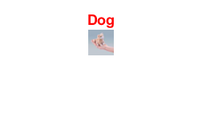 
 
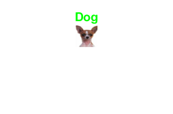 
 
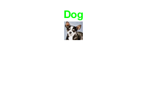 

 


#### 1b. MyNet
Lo script relativo al training è lo stesso di CIFAR10, cambiando il nome delle directory di input e del network e non è riportato per questioni di brevità. Facendo le modifiche già esplicitate, cambiano sia le immagini di input che i vari outputs.

I risultati sono visualizzati in tempo reale in Training Progress e sono mostrati nella seguente figura:

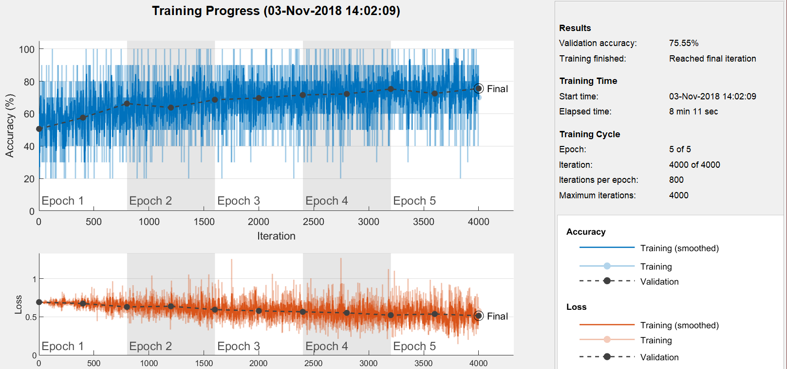 

La matrice di confusione ottenuta in questo caso è la seguente:


Le 10 immagini risultanti dal testing di CIFAR10 sono le seguenti:

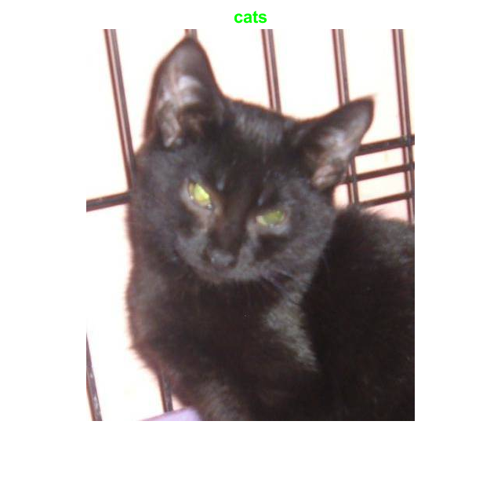 
 
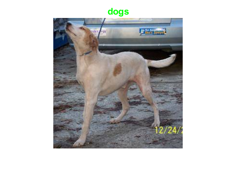 
 
 
 
 

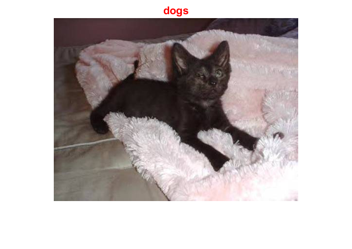 


### 2. CNN da zero con Augmenting
#### 2a. CIFAR10
In questo caso, per il training della CNN si è utilizzata l'architettura già mostrata nella sezione *1a. CIFAR10*. Tuttavia, sono differenti le immagini di input in quanto prima di essere sottoposte alla CNN vengono:
- riflesse rispetto all'asse orizzontale con una probabilità del 50%;
- scalate in maniera random sull'asse delle x entro i limiti definiti;
- tagliate in maniera random lungo l'asse delle y entro i limiti definiti.
Queste operazioni geometriche sono definite nelle seguenti righe di codice:
```matlab
  %da AugmentCIFAR10.m
  
  augmenter = imageDataAugmenter( ...
    'RandXReflection', true(1), ...
    'RandXScale',[0.5 2], ...
    'RandYShear', [0 15]);
```
Le prime 8 immagini modificate sono mostrate di seguito:

 

I risultati dell'allenamento sono visualizzati in tempo reale in Training Progress e sono mostrati nella seguente figura:

 

La matrice di confusione ottenuta in questo caso è la seguente:


Le 10 immagini risultanti dal testing di AugmentCIFAR10 sono le seguenti:

 
 
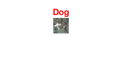 
 
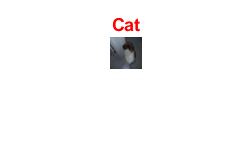 
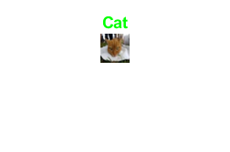 
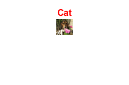 

 


#### 2b. MyNet
Anche in questo caso si sono eseguite le stesse operazioni di augmentation esplicitate nella sezione *2a. CIFAR10* per allenare il network su immagini diverse rispetto a quelle di input e valutare un miglioramento o un peggioramento delle performance.

Le prime 8 immagini modificate sono mostrate di seguito:
 

I risultati dell'allenamento sono visualizzati in tempo reale in Training Progress e sono mostrati nella seguente figura:

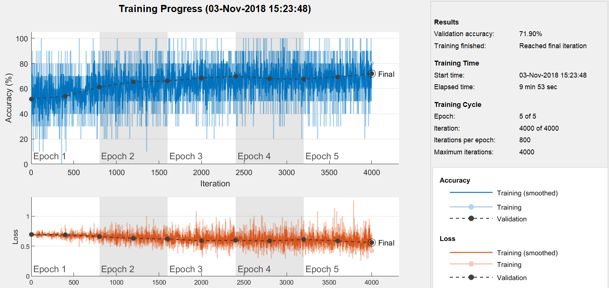 

La matrice di confusione ottenuta in questo caso è la seguente:


Le 10 immagini risultanti dal testing di AugmentMyNet sono le seguenti:

 
 
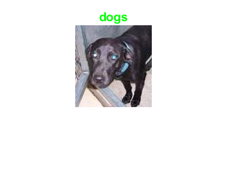 
 
 
 
 

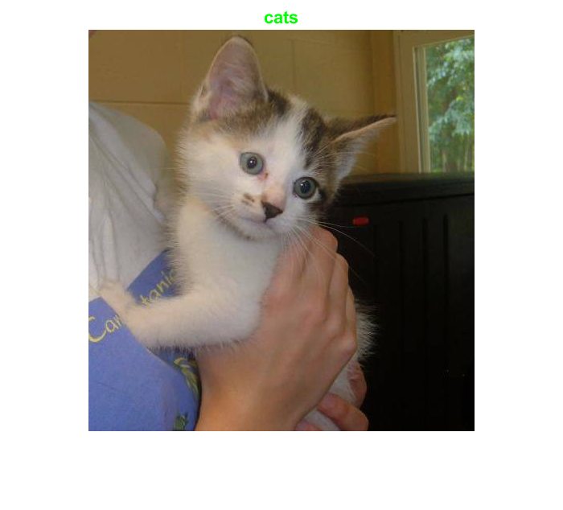 


### 3. CNN con transfer learning
Si è utilizzato un network pre-allenato chiamato `AlexNet` che è una CNN allenata su più di un milione di immagini provenienti dal database **ImageNet** contenente immagini di varie categorie, tra cui anche animali comprendenti cani e gatti. 

Tra i vantaggi del transfer learning è possibile individuare:
- maggiore velocità e facilità di ritocchi del network;
- possibilità di utilizzo anche quando non si ha a disposizione un grande numero di immagini di training.

Tramite le seguenti righe di codice è possibile osservare la struttura interna di questo network per capire come adattarla.
```matlab
  net = alexnet;
  analyzeNetwork(net)
```

Dall'analisi della struttura è emerso che gli ultimi tre strati dovessero essere adattati alla classificazione desiderata.
Nello specifico, mentre nella struttura originale il 23-esimo strato è uno strato fully-connected con output 1000 in quanto l'obiettivo originale di questo modello pre-allenato è la classificazione di immagini tra 1000 classi; nel network modificato e adattato a questo progetto il 23-esimo strato ha output 2 poichè la classificazione è legata solo a due classi (ovvero *Cat* e *Dog*).

In definitiva, la CNN è costituita da 25 strati e ha la seguente architettura:
1. Livello di Input che ha le stesse dimensioni delle immagini in input (in questo caso, [227x227x3]);
2. Livello di Convoluzione 2-dim con 96 filtri(kernels) di dimensioni 11x11x3 e passo di dimensione [4 4];
3. Livello di passaggio per la funzione ReLU;
4. Livello di Cross Channel Normalization con 5 canali per elemento;
5. Livello di Max Pooling 2-dim con dimensione di pool 3x3 e passo di dimensione [2 2];
6. Livello di Convoluzione 2-dim con 256 filtri di dimensioni 5x5x48, passo di dimensione [1 1] e zero-padding di dimensione [2 2 2 2];
7. Livello di passaggio per la funzione ReLU;
8. Livello di Cross Channel Normalization con 5 canali per elemento;
9. Livello di Max Pooling 2-dim con dimensione di pool 3x3 e passo di dimensione [2 2];
10. Livello di Convoluzione 2-dim con 384 filtri di dimensioni 3x3x256, passo di dimensione [1 1] e zero-padding di dimensione [1 1 1 1];
11. Livello di passaggio per la funzione ReLU;
12. Livello di Convoluzione 2-dim con 384 filtri di dimensioni 3x3x192, passo di dimensione [1 1] e zero-padding di dimensione [1 1 1 1];
13. Livello di passaggio per la funzione ReLU;
14. Livello di Convoluzione 2-dim con 256 filtri di dimensioni 3x3x192, passo di dimensione [1 1], zero-padding di dimensione [1 1 1 1];
15. Livello di passaggio per la funzione ReLU;
16. Livello di Max Pooling 2-dim con dimensione di pool 3x3 e passo di dimensione [2 2];
17. Livello Fully Connected con 4096 outputs;
18. Livello di passaggio per la funzione ReLU;
19. Livello di Dropout con un dropout del 50%;
20. Livello Fully Connected con 4096 outputs;
21. Livello di passaggio per la funzione ReLU;
22. Livello di Dropout con un dropout del 50%;
23. Livello Fully Connected con 2 outputs;
24. Livello per la funzione di perdita 'softmax';
25. Livello finale di classificazione.

Anche in questo caso per l'addestramento della CNN si sottopone alla rete neurale l'intero dataset mescolato più volte e per ogni iterazione di allenamento il dataset è processato in maniera che il sottoinsieme del set di training, definito dalla variabile `'MiniBatchSize'`, venga usato per valutare il gradiente della funzione di perdita e aggiornare i pesi. Come precedentemente, si è specificato il rimescolamento ad ogni epoch tramite la variabile `'Shuffle'`.

Come funzione di errore viene utilizzata `'sgdm'` con momento lasciato di default e frequenza di apprendimento iniziale `'InitialLearnRate'`.

#### 3a. CIFAR10
Di seguito è riportato lo script relativo al training:
```matlab
  %da TransfLearning_CIFAR10.m
  
  net = alexnet;
  layersTransfer = net.Layers(1:end-3);

  numClasses = 2;

  layers = [
      layersTransfer
      fullyConnectedLayer(numClasses,'WeightLearnRateFactor',20,'BiasLearnRateFactor',20)
      softmaxLayer
      classificationLayer];

  options = trainingOptions('sgdm', ...
      'MiniBatchSize',10, ...
      'MaxEpochs',5, ...
      'InitialLearnRate',0.0001, ...
      'Shuffle','every-epoch', ...
      'ValidationData',imdsValidation, ...
      'ValidationFrequency',400, ...
      'Verbose',true, ...
      'VerboseFrequency', 400, ...
      'Plots','training-progress', ...
      'ExecutionEnvironment', 'auto');

  netTransfer_CIFAR10 = trainNetwork(imdsTrain,layers,options);

  save netTransfer_CIFAR10
```

I risultati dell'allenamento sono visualizzati in tempo reale in Training Progress e sono mostrati nella seguente figura:

 

Il testing è stato eseguito come mostrato nella sezione *1a. CIFAR10*, modificando opportunamente il training set e il nome del network.

La matrice di confusione ottenuta in questo caso è la seguente:


Le 10 immagini risultanti dal testing di TransfLearningCIFAR10 sono le seguenti:

 
 
 
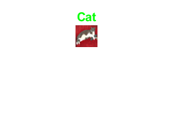 
 
 
 

 


#### 3b. MyNet
Anche in questo caso si è eseguito lo stesso training mostrato in sezione *3a. CIFAR10*, modificando opportunamente il dataset e il nome del network da allenare e salvare.

I risultati dell'allenamento sono visualizzati in tempo reale in Training Progress e sono mostrati nella seguente figura:

 

Il testing è stato eseguito come mostrato nella sezione *1a. CIFAR10*, modificando opportunamente il training set e il nome del network.

La matrice di confusione ottenuta in questo caso è la seguente:


Le 10 immagini risultanti dal testing di TransfLearningMyNet sono le seguenti:

 
 
 
 
 
 
 

 


### 4.SVM
L'approccio sfruttato in questo caso può essere inteso come 'ponte' tra il Deep Learning e il Machine Learning. Nello specifico si utilizza la CNN `AlexNet` come estrattore di features che successivamente sono utilizzate come input per le support vector machines (SVM).  Questo è possibile poichè, siccome tutti i layer hanno il compito di apprendere determinate features, esse possono essere estratte dalla rete in qualsiasi momento durante l'addestramento. 

Le features più semplici come gli spigoli sono rilevate nel primo strato convoluzionale (*conv1*) mentre quelle più difficili vengono apprese negli strati successivi che combinano le features degli strati precedenti.

#### 4a.CIFAR10
In questo caso, non è stato utilizzato il validation set, non dovendo aggiustare i parametri della CNN. Da ciò consegue l'utilizzo di 5000 immagini per il training (contro le 4000 dei casi precedenti) e 1000 di testing.
Tramite le seguenti righe di codice, si è presa in considerazione un'immagine di training e sono state generate:
1. un'immagine che mostra tutti i canali relativi alle funzioni di attivazione del primo livello convoluzionale;
2. un'immagine che mostra il canale avente la funzione di attivazione più forte (spigoli più accentuati).

```matlab
%da SVM_CIFAR10.m

%Show activations in first convolutional layer
figure
M = readimage(imdsTrain,2);
imshow(M)
act1=activations(net,M,'conv1');
sz = size(act1);
act1 = reshape(act1,[sz(1) sz(2) 1 sz(3)]);

figure
L = montage(mat2gray(act1))

[maxValue,maxValueIndex] = max(max(max(act1)));
act1chMax = act1(:,:,:,maxValueIndex);
act1chMax = mat2gray(act1chMax);

%Show strongest channel
figure
N = montage({M,act1chMax});
```

I risultati sono mostrati di seguito.
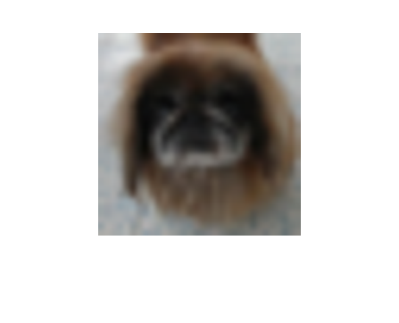
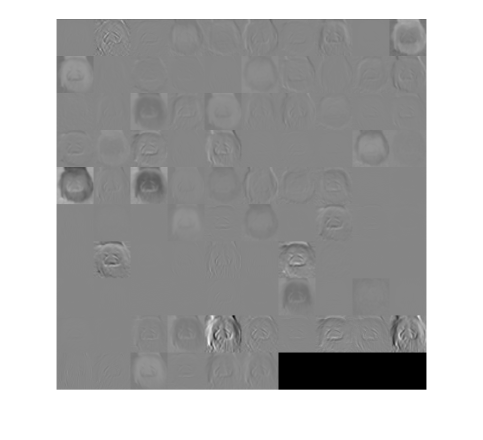
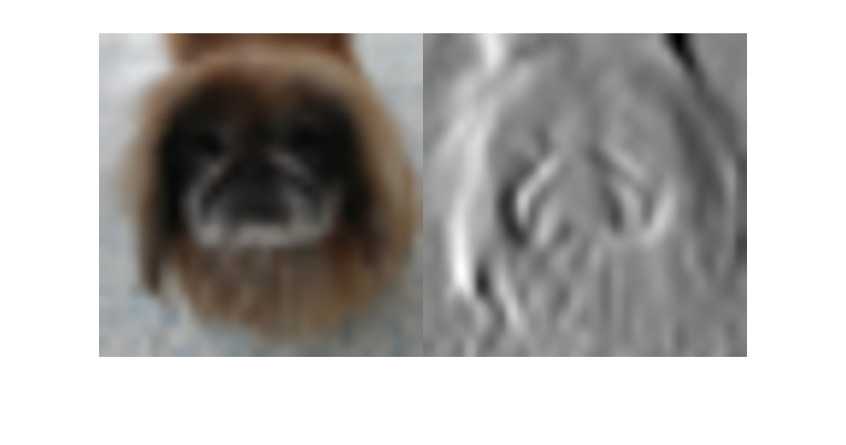

Nelle seguenti righe di codice è riportato il procedimento di:
- training comprendente:
    - estrazione delle features dallo strato `fc7`, in quanto contenente features di alto-livello essendo più in profondità;
    - fitting del classificatore di immagini (SVM) tramite la funzione `fitcecoc`.
- testing comprendente:
    - classificazione e previsione delle immagini di testing tramite la funzione `predict`;
    - display di 10 immagini di testing;
    - display dell'accuratezza e della matrice di confusione.

```matlab
%da SVM_CIFAR10.m

net = alexnet;
layer = 'fc7';
featuresTrain = activations(alexnet,imdsTrain,layer,'OutputAs','rows');
featuresTest = activations(alexnet,imdsTest,layer,'OutputAs','rows');

YTrain = imdsTrain.Labels;
YTest = imdsTest.Labels;

classifier = fitcecoc(featuresTrain,YTrain);

%Display some images
YPred = predict(classifier,featuresTest);

for i = 1:10
    ii=randi(2000);
    I = imread(imdsTest.Files{ii});
    figure
    imshow(I);
    if YPred(ii) == YTest(ii)
       colorText = 'g'; 
    else
        colorText = 'r';
    end
    title(char(YPred(ii)),'Color',colorText);
end

accuracy = mean(YPred == YTest)

figure
plotconfusion(YTest, YPred)
```

Le 10 immagini risultanti dal testing sono le seguenti.
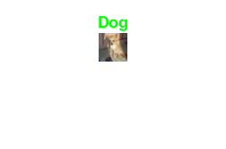 
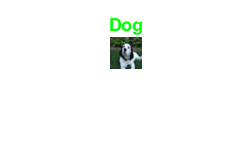 
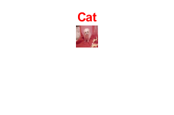 
 
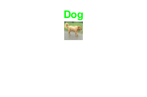 
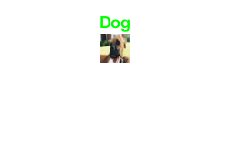 
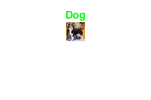 

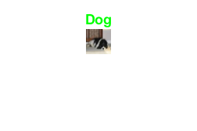 
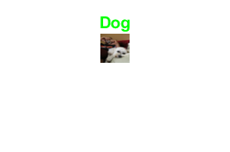

La matrice di confusione è mostrata di seguito.


#### 4b.MyNet
Si è utilizzato lo stesso codice mostrato in sezione *4a.CIFAR10*, cambiando opportunamente il dataset.

Un'immagine di training, l'immagine corrispondente che mostra tutti i canali del primo strato convoluzionale e quella che mostra il canale con la funzione di attivazione più forte sono mostrate di seguito.

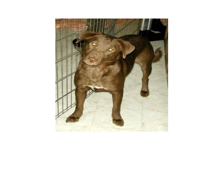
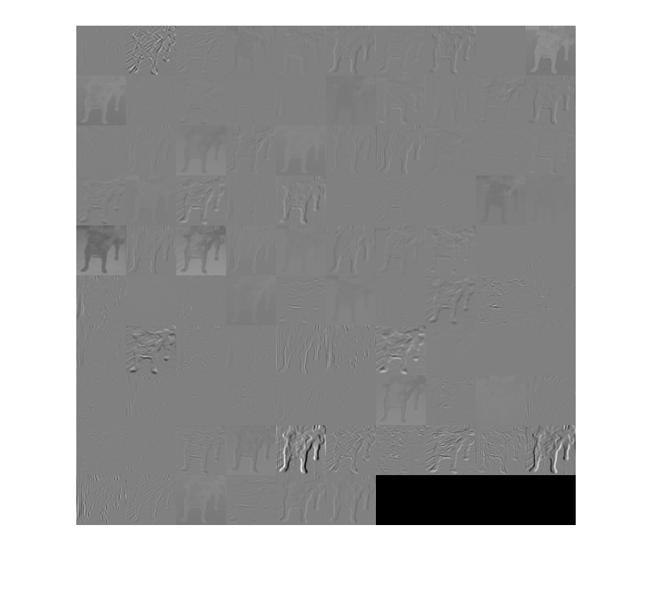
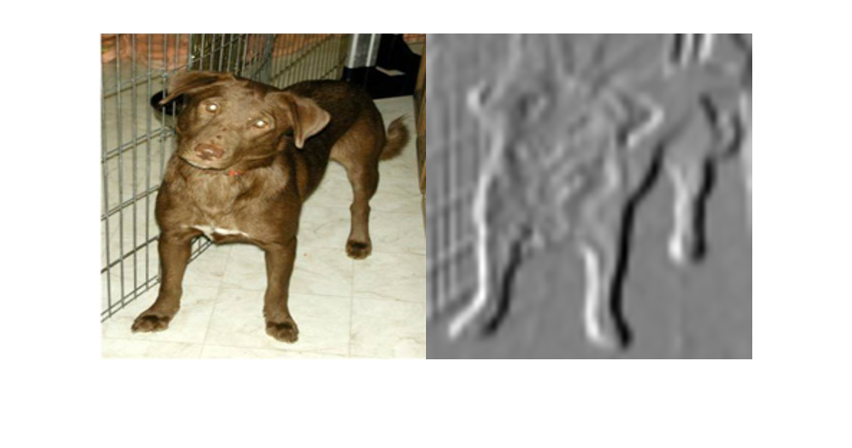

Le 10 immagini risultanti dal testing sono le seguenti.

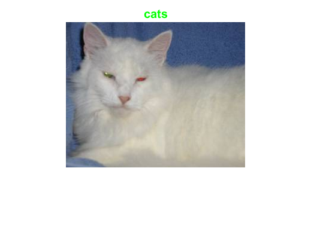 
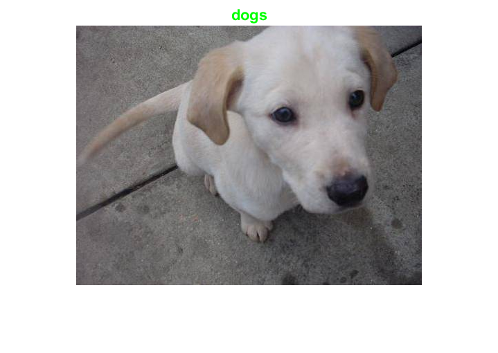 
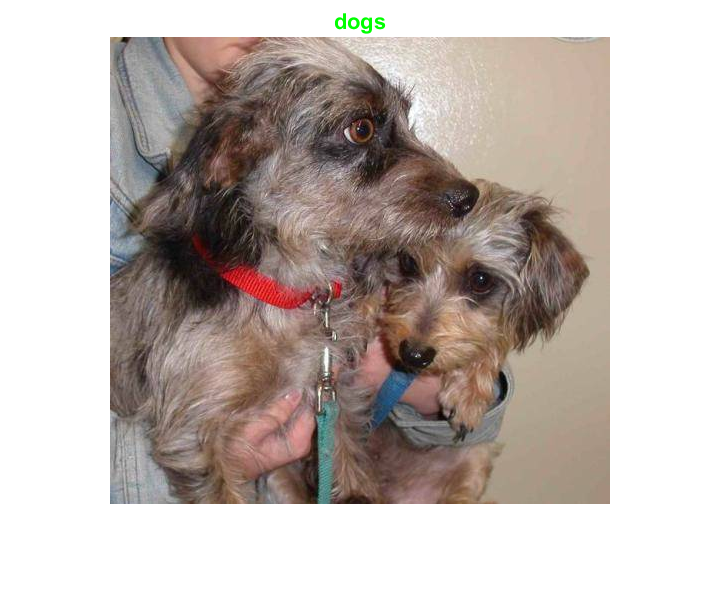 
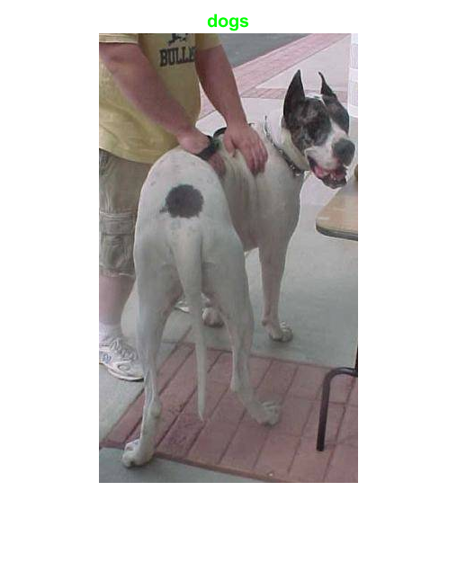 
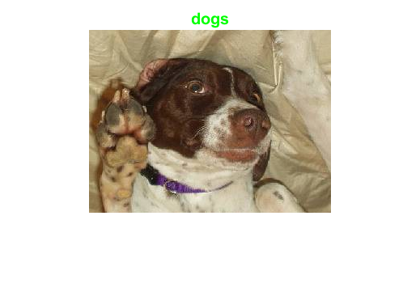 
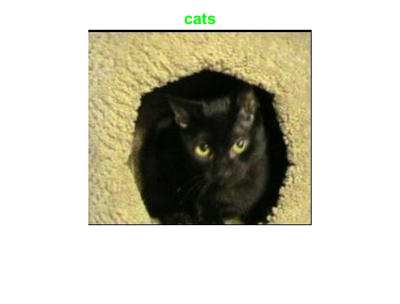 
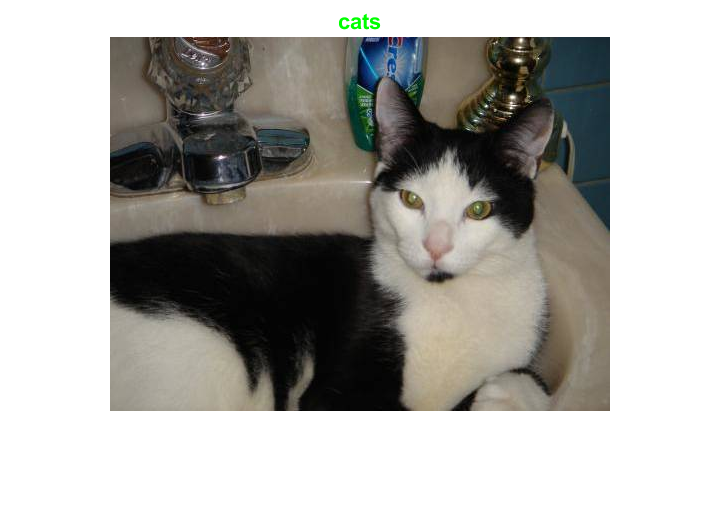 
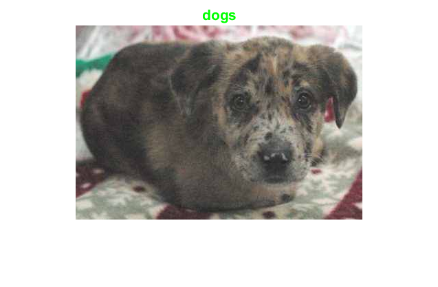
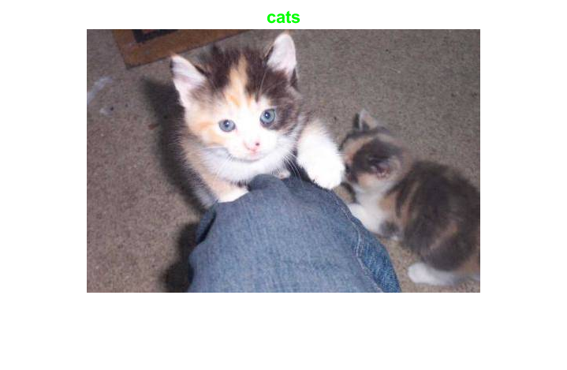 
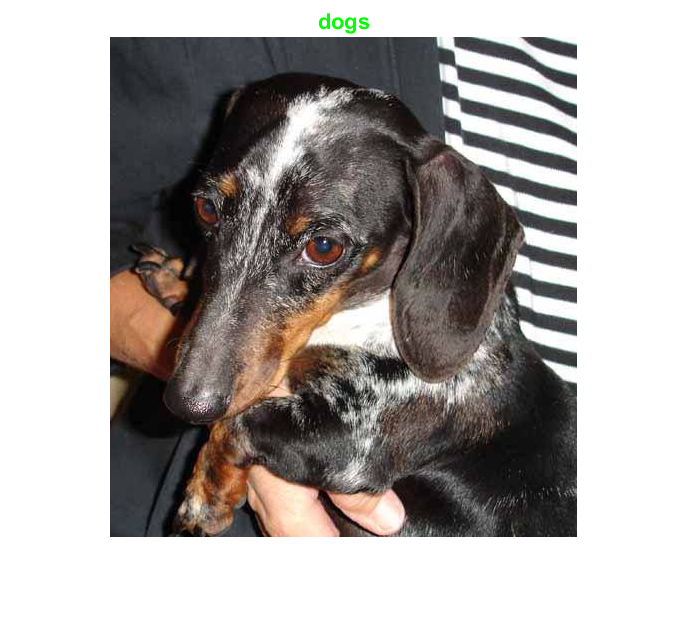

La matrice di confusione è mostrata di seguito.


## Risultati e commenti finali
Una volta fatto girare il programma i risultati ottenuti tenendo conto di 80% training, 20% validation e stesso numero di esempi tra validation e testing (si ricorda che il testing è realizzato con nuovi esempi), sono i seguenti:

|CNN per CIFAR10|Errori Commessi|Percentuale letta correttamente (Testing)|Percentuale letta correttamente (Validation)|
|:--|:--:|:--:|:--:|
|1. Da zero|580/2000|71.0%|70.8%|
|2. Da zero + Augumentation|636/2000|68.0%|68.3%|
|3. Pre-allenata con AlexNet|220/2000|89.0%|89.2%|
|4. SVM|390/2000|80.5%|/|

|CNN per MyNet|Errori Commessi|Percentuale letta correttamente (Testing)|Percentuale letta correttamente (Validation)|
|:--|:--:|:--:|:--:
|1. Da zero|491/2000|75.4%|75.6%|
|2. Da zero + Augmentation|560/2000|72.0%|71.9%|
|3. Pre-allenata con AlexNet|53/2000|97.4%|97.3%|
|4. SVM|77/2000|96.2%|/|

Osservando la tabella è possibile notare come, nonostante la diversità dei dataset, in entrambi i casi il classificatore migliore sia quello basato sulla CNN pre-allenata con AlexNet. Questo risultato è compatibile con quanto ci si aspetta dalla teoria ed è spiegabile con il fatto che questa CNN è formata da un maggiore numero di strati (più parametri in gioco, maggiore ottimizzazione) ed è pre-allenata su altre immagini tra cui quelle delle stesse categorie rispetto a quelle che si vogliono classificare.

Nonostante il classificatore basato sulla SVM non è risultato essere il migliore, è possibile notale come raggiunga un'accuratezza il cui valore si avvicina molto a quello del classificatore CNN pre-allenato con AlexNet. Questo ritorna vantaggioso quando non si ha la possibilità di utilizzare la GPU ma non si vogliono attendere tempi computazionali troppo lunghi in quanto, siccome l'estrazione delle features richiede solo un singolo passaggio attraverso i dati, non richiede accelerazione per il training. Nella tabella mostrata nella sezione *Extra* è possibile visualizzare i tempi ottenuti nella fase di training.

Al contrario, il classificatore peggiore risulta quello basato sulla CNN da 0 che è allenato su immagini augmented. Questo è dovuto probabilmente al fatto che il testing è fatto tramite immagini che sono più simili a quelle di input che a quelle modificate attraverso le operazioni geometriche esplicitate. 

## Extra
Di seguito, per completezza, sono riportati i tempi di training nelle varie casistiche e per i due dataset.

|CNN|Tempo di Training per CIFAR10|Tempo di Training per MyNet|
|:--|:--:|:--:|
|1. Da zero|3 min 22 sec|8 min 11 sec|
|2. Da zero + Augmentation|3 min 53 sec|9 min 53 sec|
|3. Pre-allenata con AlexNet|22 min 43 sec|29 min 25 sec|
|4. SVM|6 min 58 sec|6 min 28 sec|
