# Confronto di CNN per la classificazione di cani e gatti
## Elaborato per il corso di Analisi delle Immagini
### Miriam Santoro
#### aa. 2017/2018, Università di Bologna - Corso di laurea magistrale in Fisica Applicata

## Scopo del progetto
Il presente lavoro è stato realizzato in linguaggio `matlab` e si pone come obiettivo l'implementazione e la valutazione di:
1. Rete neurale convoluzionale (CNN) da zero;
2. Rete neurale convoluzionale (CNN) da zero + Augment del dataset;
3. Modello di CNN pre-allenato (`AlexNet`).

Queste tre casistiche sono state applicate a due dataset diversi, ovvero:
1. `CIFAR10`
2. `Kaggle`

Il progetto ha previsto anche l'implementazione di add-ons per matlab, quali:
1. `Image Processing Toolbox`
2. `Neural Network Toolbox`
3. `Parallel Computing Toolbox`
4. `Neural Network Toolbox Model for AlexNet Network`
5. `Deep Learning Network Analyzer for Neural Network Toolbox`

## Esecuzione del progetto
Le reti neurali sono state implementate in 6 script diversi, a seconda della loro tipologia e del dataset utilizzato. Nello specifico:
- `TrainingCIFAR10.m` contiene la CNN allenata da zero sul dataset CIFAR10;
- `Training.m` contiene la CNN allenata da zero sul dataset Kaggle;
- `Training_AugmentCIFAR10.m` contiene la CNN allenata da 0 sulle immagini augmented del dataset CIFAR10;
- `Training_Augment.m` contiene la CNN allenata da 0 sulle immagini augmented del dataset Kaggle;
- `TrasfLearning_CIFAR10.m` contiene la CNN AlexNet pre-allenata adattata alle immagini del dataset CIFAR10;
- `TrasfLearning.m` contiene la CNN AlexNet pre-allenata adattata alle immagini del dataset Kaggle.

## Dataset (Note preliminari)
Di seguito si descrivono i dataset utilizzati per ogni CNN. Entrambi i dataset sono stati divisi in 90% training e 10% testing, supponendo che il numero di immagini per classe sia 60000, per evitare errori di overfitting.
Inoltre le 5000 immagini di training sono state ulteriormente divise in 70% training e 30% validation per regolare l'architettura del classificatore stesso, aggiustandone i parametri.

Per adattare i dataset alle dimensioni di input delle CNN sono usati gli script:
- `readFunctionTrain` per la CNN da 0 e la CNN con l'augment. Questa funzione è in grado di ridimensionare ogni immagine di input in maniera da avere un'immagine di output di dimensione 32x32;
- `readFunctionTrain2` per la CNN basata su AlexNet. Questa funzione è in grado di ridimensionare ogni immagine di input in maniera da avere un'immagine di output di dimensione 227x227.

In realtà ogni immagine ha dimensioni [n_pixel x n_pixel x 3] in quanto è un'immagine a colori.
### CIFAR10
Il dataset CIFAR-10 è formato da 60000 immagini colorate 32x32 disposte in 10 classi. Quindi, ci sono 6000 immagini per classe che sono divise in 5000 immagini di training e 1000 immagini di testing.

In questo progetto vengono usate solo 2 delle 10 classi appartenenti a questo dataset: `Cat` e `Dog`.

Per scaricare il dataset e prepararlo in maniera da disporre le immagini in apposite cartelle è stato utilizzato lo script `DownloadCIFAR10.m`, scaricato dal sito di matlab (link: https://www.mathworks.com/matlabcentral/mlc-downloads/downloads/submissions/62990/versions/3/previews/DeepLearningDemos/DownloadCIFAR10.m/index.html).

I dati sono importati come mostrato nel seguente esempio di codice:
```matlab
  #from TrainingCIFAR10.m
  categories = {'Dog','Cat'};

  rootFolder = 'cifar10/cifar10Train';
  imds = imageDatastore(fullfile(rootFolder, categories), ...
      'LabelSource', 'foldernames');
  imds.ReadFcn = @readFunctionTrain;
  
  [imdsTrain,imdsValidation] = splitEachLabel(imds,0.7,'randomized');     #divide train set e validation set
```

### Kaggle
Il dataset Kaggle è formato da 25000 immagini colorate di dimensioni diverse disposte in due classi (ovvero `cats` e `dogs`). Quindi per ogni classe si hanno a disposizione 12500 immagini totali.

In questo progetto vengono usate solo 5000 immagini di training e 1000 immagini di testing per ogni classe. Le immagini di training sono le prime 5000, quelle di testing sono tra 5000 e 6000. 

Il dataset è stato scaricato dal sito della Kaggle e le immagini sono state poste manualmente nelle rispettive cartelle.

I dati sono importati come mostrato nel seguente esempio di codice:
```matlab
  #from Training.m
  categories = {'dogs','cats'};

  rootFolder = 'dataset/train_set';
  imds = imageDatastore(fullfile(rootFolder, categories), ...
      'LabelSource', 'foldernames');
  imds.ReadFcn = @readFunctionTrain;

  [imdsTrain,imdsValidation] = splitEachLabel(imds,0.7,'randomized');
```


## Analisi delle CNN
Le reti neurali convoluzionali (CNN) hanno architetture che le rendono particolarmente adatte al riconoscimento delle immagini, in maniera da poterle classificare. Nello specifico, i diversi layer della rete neurale imparano a rilevare e identificare le diverse features delle immagini. A questi layer si aggiungono il penultimo layer che genera un vettore delle stesse dimensioni del numero di classi che la rete deve essere in grado di prevedere e l'ultimo layer che fornisce l'output di classificazione.

Siccome le CNN sono addestrate su molte immagini e lavorano con una grande quantità di dati e con diverse architetture, si ritiene opportuno utilizzare la GPU in quanto fondamentale per velocizzare significativamente il tempo necessario ad allenare un modello.

Esempio di struttura di una CNN.


Di seguito sono riportate e spiegate le varie tipologie di strati utilizzati nelle diverse CNN:
- **Livello di Input** dell'immagine che immette le immagini sulla rete e applica la normalizzazone dei dati

- **Livello di Convoluzione 2-dim** che applica filtri concoluzionali all'input. Questo livello convolve l'input muovendo i filtri delle dimensioni specificate verticalmente e orizzontalmente, calcolando il prodotto scalare dei pesi e dell'input e aggiungendo un termine di bias. I parametri del livello consistono in un set di filtri apprendibili (o kernel), che hanno un piccolo campo recettiv, ma si estengo lungo tutta la pronfondità del volume di input. Durante il passaggio all'indietro (forward) ogni filtro fa convoluzione lungo la larghezza e l'altezza del volume di input, calcolando il prodotto scalare tra le entrate del filtro e l'input e producendo una mappa di attivazione 2-dim di quel filtro. Il network quindi apprende i filtri che attiva quando trova qualche specifico tipo di feature a qualche posizione spaziale nell'input. L'operazione di convoluzione riduce il numero di parametri liberi, permettendo al network di esere più profondo con meno parametri. Ad esempio, usare regioni di dimensione 5x5, ognuna con gli stessi pesi condivisi, richiede solo 25 parametri apprendibili. Inquesto modo, risolve il problema dei gradienti che svaniscono o esplodono nell'allenamento tradizionale di network neurali multi strato con alcuni layer usando la backpropagation. La dimensione di step con cui il filtro si muove è chiamata *stride*. Si può anche applicare uno zero padding ai limiti dell'immagine di input verticalmente e orizzontalmente usando il *'Padding'*. Il padding consiste in righe e colonne di zeri aggiunti ai limiti di un immagine di input. Aggiustando il padding, si può controllare la dimensione di output dello strato.

- **Livello di Max Pooling 2-dim** che divide l'immagine di input in un set di rettangoli che non si sovrappongono e, per ogni sotto-regione, fornisce in output il massimo. Quindi, in poche parole, questo livello combina gli output (massimi) di ogni cluster di neuroni in uno strato all'interno di un singolo neurone nello strato successivo.

- **Livello di passaggio per la funzione ReLU**, utile per scartare i valori negativi ottenuti finora. Quindi è sostanzialmente una funzione di threshold del tipo: 

<a href="https://www.codecogs.com/eqnedit.php?latex=f(x)&space;=&space;\begin{cases}&space;x,&space;&&space;x&space;\geq&space;0&space;\\&space;0,&space;&&space;x<0&space;\end{cases}" target="_blank"></a>

- **Livello di Cross Channel Normalization**, utile per normalizzare il canale tramite la normalizzazione di una risposta locale del canale. Nello specifico questo canale rimpiazza ogni elemento con un valore normalizzato che ottiene usando gli elementi da un certo numero di canali vicini (elementi nella finestra di normalizzazione).

- **Livello di Avg Pooling** che divide l'immagine di input in un set di rettangoli che non si sovrappongono e, per ogni sotto-regione, fornisce in output il valore medio.

- **Livello di Dropout**, utile per settare in maniera random gli elementi di input uguali a 0 con una data probabilità.

- **Livello Fully Connected**, utile a collegare i neuroni a tutte le attivazioni nel livello precedente. Nello specifico l'attivazione è calcolata moltiplicando gli input per una matrice di pesi e aggiungendo un vettore di bias.

- **Livello per la funzione di perdita 'softmax'**, utile a specificare come l'allenamento penalizzi la deviazione tra labels predette e vere. Questo strato definisce la funzione di attivazione di output, ovvero:

   <a href="https://www.codecogs.com/eqnedit.php?latex=y_r(x)&space;=\frac{exp(a_r(x)}{\sum^k_{j=1}exp(a_j(x))}" target="_blank"></a>

dove <a href="https://www.codecogs.com/eqnedit.php?latex=\inline&space;0&space;\leq&space;y_r(x)&space;\leq&space;1" target="_blank"></a> e <a href="https://www.codecogs.com/eqnedit.php?latex=\inline&space;\sum^k_{j=1}y_j=1" target="_blank"></a>.

- **Livello finale di classificazione** che calcola la cross entropy loss perchè è un problema di classificazione tra classi che si escludono a vicenda. In definitiva, la funzione di perdita è:
<a href="https://www.codecogs.com/eqnedit.php?latex=\text{loss}=&space;\sum^N_{i=1}\sum^k_{j=1}&space;t_{ij}&space;\text{ln}&space;y_{ij}" target="_blank"></a>.

### 1. CNN from scratch
La CNN creata da 0 è formata da 15 strati con la seguente architettura:
1. Livello di Input dell'immagine;
2. Livello di Convoluzione 2-dim;
3. Livello di Max Pooling 2-dim;
4. Livello di passaggio per la funzione ReLU;
5. Livello di Convoluzione 2-dim, avente lo stesso scopo del livello 2;
6. Livello di passaggio per la funzione ReLU, avente lo stesso scopo del livello 4;
7. Livello di Avg Pooling;
8. Livello di Convoluzione 2-dim, avente lo stesso scopo del livello 2;
9. Livello di passaggio per la funzione ReLU, avente lo stesso scopo del livello 4;
10. Livello di Avg Pooling, avente lo stesso scopo del livello 7;
11. Livello Fully Connected;
12. Livello di passaggio per la funzione ReLU, avente lo stesso scopo del livello 4;
13. Livello Fully Connected, avente lo stesso scopo del livello 12;
14. Livello per la funzione di perdita 'softmax';
15. Livello finale di classificazione.

Per l'addestramento della CNN si sottopone alla rete neurale l'intero dataset mescolato più volte, dove il numero di "mescolamenti" è chiamato `MaxEpochs`.
Inoltre per ogni iterazione di allenamento il dataset è processato in maniera che un sottoinsieme del set di training, definito dalla variabile `MiniBatchSize` venga usato per valutare il gradiente della funzione di perdita e aggiornare i pesi.

Come funzione di errore viene utilizzata `sgdm`, ovvero *Stochastic Gradient Descent with Momentum optimizer*, una funzione che esegue la discesa gradiente stocastica con un'ottimizzazione del momento che, in questo caso è stato lasciato di default.
L'algoritmo di discesa gradiente aggiorna i parametri del network (pesi e bias, definiti nell'architettura) per minimizzare la funzione di perdita prendendo piccoli steps nella direzione del gradiente negativo della perdita, definiti da:

<a href="https://www.codecogs.com/eqnedit.php?latex=\theta_{l&plus;1}&space;=&space;\theta_{l}-\alpha&space;\Delta&space;E(\theta_l)" target="_blank"></a>

dove l è il numero di iterazioni, <a href="https://www.codecogs.com/eqnedit.php?latex=\inline&space;\alpha&space;>0" target="_blank">0" title="\alpha >0" /></a> è la frequenza di apprendimento, <a href="https://www.codecogs.com/eqnedit.php?latex=\inline&space;\theta" target="_blank"></a> è il vettore parametro e <a href="https://www.codecogs.com/eqnedit.php?latex=\inline&space;E(\theta)" target="_blank"></a> è la funzione di perdita. 
L'algoritmo di discesa gradiente stocastica valuta il gradiente e aggiorna i parametri usando un subset del training set, chiamato mini-batch. Ad ogni iterazione, cioè ogni valutazione del gradiente usando il mini-batch, l'algoritmo fa un passo avanti nella minimizzazione la funzione di perdita. L'intero passo dell'algoritmo di training sull'intero set di training usando le mini-batches è un epoca-

All'algoritmo di discesa stocastica viene aggiunto un termine di momento per ridurre l'oscillazione lungo il cammino di discesa profonda verso il massimo. In questo caso, l'equazione che governa questo processo è la seguente:

<a href="https://www.codecogs.com/eqnedit.php?latex=\theta_{l&plus;1}&space;=&space;\theta_l-\alpha&space;\Delta&space;E(\theta_l)&space;&plus;\gamma(\theta_l-\theta_{l-1})" target="_blank"></a>

dove <a href="http://www.codecogs.com/eqnedit.php?latex=\inline&space;\dpi{120}&space;\gamma" target="_blank"></a> determina il contributo del precedente step di gradiente all'iterazione corrente.  Inoltre, si è specificata anche la frequenza di apprendimento iniziale, tramite il parametro `InitialLearningRate`.
#### 1a. CIFAR10
Di seguito è riportato lo script relativo al training:
```matlab
  da training.CIFAR10
  varSize = 32;
  conv1 = convolution2dLayer(5,varSize,'Padding',2,'BiasLearnRateFactor',2);
  conv1.Weights = gpuArray(single(randn([5 5 3 varSize])*0.0001));
  fc1 = fullyConnectedLayer(64,'BiasLearnRateFactor',2);
  fc1.Weights = gpuArray(single(randn([64 576])*0.1));
  fc2 = fullyConnectedLayer(2,'BiasLearnRateFactor',2);
  fc2.Weights = gpuArray(single(randn([2 64])*0.1));

  layers = [
      imageInputLayer([varSize varSize 3], 'Name', 'input');
      conv1;
      maxPooling2dLayer(3,'Stride',2, 'Name', 'max_pool');
      reluLayer('Name', 'relu_1');
      convolution2dLayer(5,32,'Padding',2,'BiasLearnRateFactor',2, 'Name', 'conv_2');
      reluLayer('Name', 'relu_2');
      averagePooling2dLayer(3,'Stride',2, 'Name', 'avg_pool_1');
      convolution2dLayer(5,64,'Padding',2,'BiasLearnRateFactor',2, 'Name', 'conv_3');
      reluLayer('Name', 'relu_3');
      averagePooling2dLayer(3,'Stride',2, 'Name','avg_pool_2');
      fc1;
      reluLayer('Name', 'relu_4');
      fc2;
      softmaxLayer('Name', 'softmax');
      classificationLayer('Name', 'classification')];

  opts = trainingOptions('sgdm', ...
      'InitialLearnRate', 0.001, ...
      'L2Regularization', 0.004, ...
      'MaxEpochs', 10, ...
      'Shuffle','every-epoch', ...
      'MiniBatchSize', 10, ...
      'ValidationData',imdsValidation, ...
      'ValidationFrequency',350, ...
      'Verbose', true, ...
      'VerboseFrequency', 350, ...
      'Plots','training-progress', ...
      'ExecutionEnvironment', 'auto');

  [net, info] = trainNetwork(imdsTrain, layers, opts);

  cifar10_net= net;
  save cifar10_net
```

I risultati sono visualizzati in tempo reale in Training Progress e sono mostrati nella seguente figura:

 


Per quanto riguarda il testing si è verificato che il valore dell'accuratezza fosse compatibile con quello della validazione ottenuta durante il processo di training. Una volta classificate, le immagini vengono mostrate con la relativa label contrassegnata con il colore rosso se è errata e verde se è giusta. Inoltre, l'accuratezza di testing è fornita dalla media tra i termini della diagonale della matrice di confusione ciascuno normalizzato per il numero totale di esempi di training.
Di seguito è riportato lo script relativo al testing:
```matlab
  da TrainingCIFAR10.m
  load cifar10_net;
  rootFolder2 = 'cifar10/cifar10Test';
  imdsTest = imageDatastore(fullfile(rootFolder2, categories), ...
      'LabelSource', 'foldernames');
  imdsTest.ReadFcn = @readFunctionTrain;

  labels = classify(cifar10_net, imdsTest);

  for i = 1:50
      ii = randi(2000);
      im = imread(imdsTest.Files{ii});
      imshow(im);
      if labels(ii) == imdsTest.Labels(ii)
         colorText = 'g'; 
      else
          colorText = 'r';
      end
      title(char(labels(ii)),'Color',colorText);
  end

  % This could take a while if you are not using a GPU
  confMat = confusionmat(imdsTest.Labels, labels);
  confMat2 = confMat./sum(confMat,2);
  mean(diag(confMat2))
```

Di seguito sono riportate 10 immagini risultanti dal testing di CIFAR10:

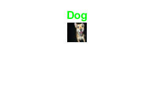 
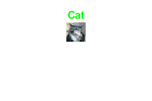 
 
 
 
 
 
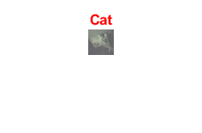
 
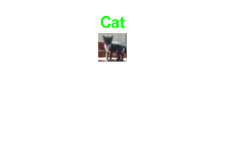

#### 1b. MyNet
Lo script relativo al training è lo stesso di CIFAR10, cambiando il nome delle directory di input e del network. In questo modo cambiano le immagini di input e i vari outputs e non vengono riportate per questioni di brevità.

I risultati sono visualizzati in tempo reale in Training Progress e sono mostrati nella seguente figura:

 

Di seguito sono riportate 10 immagini risultanti dal testing di CIFAR10:

 
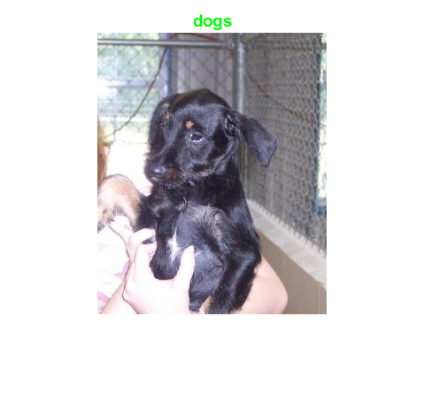 
 
 
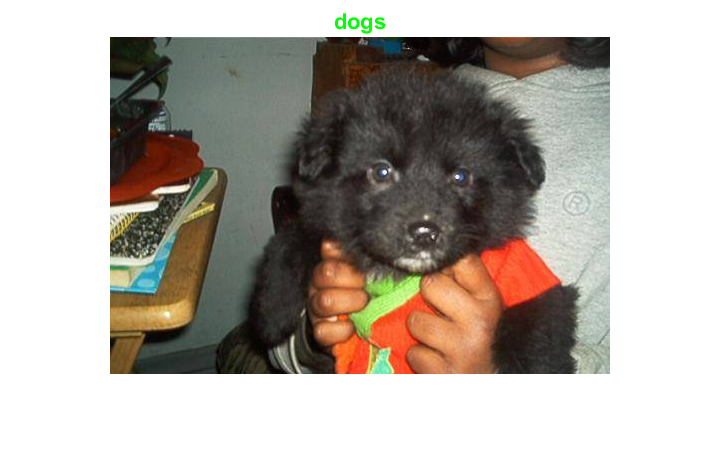 
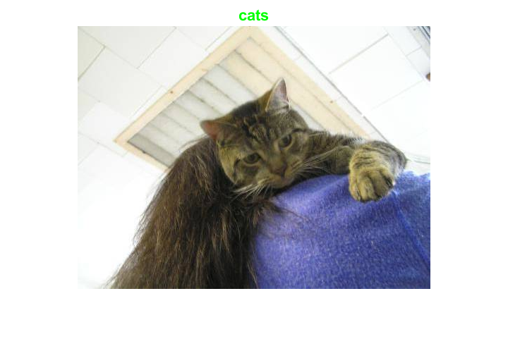 
 

 
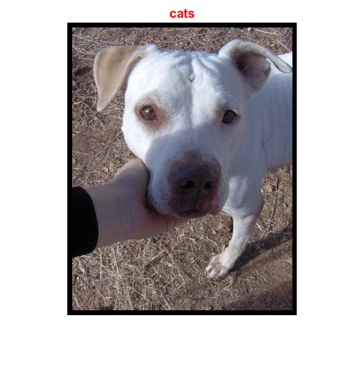


### 2. CNN da zero con Augmenting
#### 2a. CIFAR10
In questo caso, per il training della CNN si è utilizzata la stessa architettura, già mostrata nella sezione *1a. CIFAR10*. Sono differenti, tuttavia, le immagini di input che prima vengono:
- riflesse rispetto all'asse orizzontale con una probabilità del 50%;
- scalate in maniera random sull'asse delle x entro i limiti definiti;
- tagliate in maniera random lungo l'asse delle y entro i limiti definiti.
Queste operazioni geometriche sono permesse grazie il seguente script:
```matlab
  #da AugmentCIFAR10.m
  
  augmenter = imageDataAugmenter( ...
    'RandXReflection', true(1), ...
    'RandXScale',[0.5 2], ...
    'RandYShear', [0 15]);
```
Le prime 8 immagini modificate sono mostrate di seguito:

 

I risultati dell'allenamento sono visualizzati in tempo reale in Training Progress e sono mostrati nella seguente figura:

 

Di seguito sono riportate 10 immagini risultanti dal testing di CIFAR10:

 
 
 
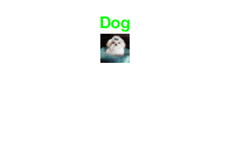 
 
 
 

 
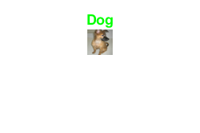

#### 2b. MyNet
Anche in questo caso si sono eseguite le stesse operazioni di augmenting esplicitate nella sezione *2a. CIFAR10* per allenare il network su immagini diverse rispetto a quelle di input e notare se le performance migliorassero o peggiorassero.

Le prime 8 immagini modificate sono mostrate di seguito:
 

I risultati dell'allenamento sono visualizzati in tempo reale in Training Progress e sono mostrati nella seguente figura:

 

Di seguito sono riportate 10 immagini risultanti dal testing di CIFAR10:

 
 
 
 
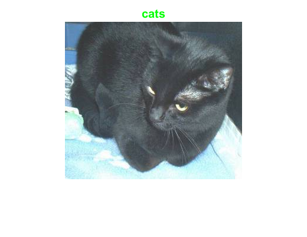 
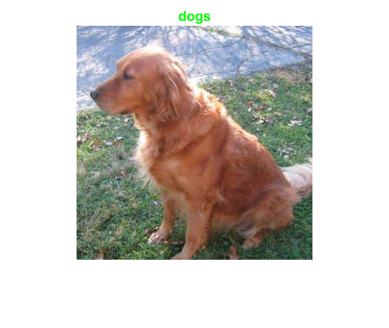 
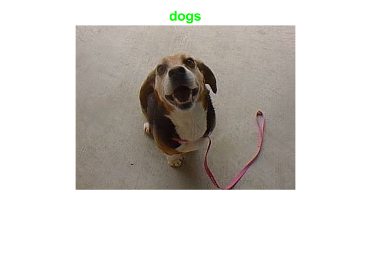 

 
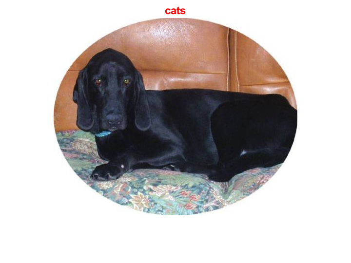
